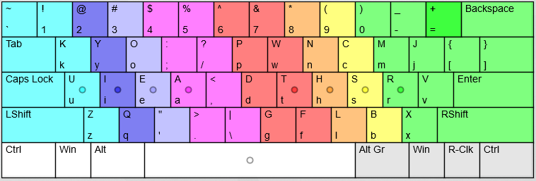

# KYO keyboard layout
Alternative English keyboard layout

I've only tested this on the keyboard layout analyzer on patorjk.com.
It scores a 72.17 on the Alice in Wonderland text.
If you want to test it yourself just import the json from the layout.json file.

[http://patorjk.com/keyboard-layout-analyzer/#/config](http://patorjk.com/keyboard-layout-analyzer/#/config)

**My considerations into making this layout:**

1. Common letters on the home row
2. Consonants and vowels on separate hands - most words are ~60% consonants, ~40% vowels anyway
3. Common digraphs on separate fingers (avoiding repeated use of the same finger)
4. Focus on the (stronger) index and middle fingers

I'd be interested to see if anyone can get a higher score. Let me know.
Enjoy!